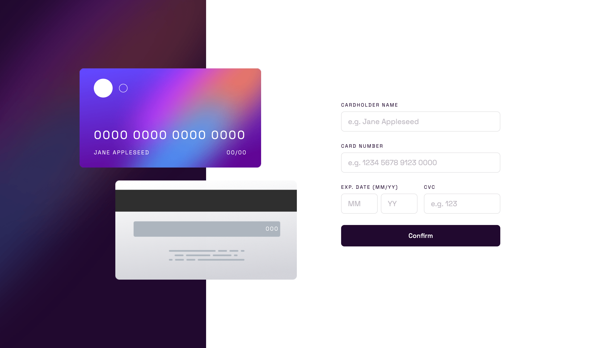

# Frontend Mentor - Interactive card details form solution

This is a solution to the [Interactive card details form challenge on Frontend Mentor](https://www.frontendmentor.io/challenges/interactive-card-details-form-XpS8cKZDWw). Frontend Mentor challenges help you improve your coding skills by building realistic projects. 

## Table of contents

- [Overview](#overview)
  - [The challenge](#the-challenge)
  - [Screenshot](#screenshot)
  - [Links](#links)
- [My process](#my-process)
  - [Built with](#built-with)
  - [What I learned](#what-i-learned)
  - [Continued development](#continued-development)
  - [Useful resources](#useful-resources)
- [Author](#author)

## Overview

### The challenge

Users should be able to:

- Fill in the form and see the card details update in real-time
- Receive error messages when the form is submitted if:
  - Any input field is empty
  - The card number, expiry date, or CVC fields are in the wrong format
- View the optimal layout depending on their device's screen size
- See hover, active, and focus states for interactive elements on the page

### Screenshot

### Links

- Solution URL: [Github repo here](https://github.com/nicholasboyce/interactive-card-details-form)
- Live Site URL: [Github pages here](https://nicholasboyce.github.io/interactive-card-details-form)

## My process

### Built with

- Semantic HTML5 markup
- CSS custom properties
- Flexbox
- CSS Grid
- Mobile-first workflow

### What I learned

I learned about maintaining aspect ratio for designing things like the credit cards here which are not typical CSS/HTML elements.

### Continued development

This was a good exercise in distinguishing when to use Flexbox vs Grid. There was a surprising amount of complexity hidden in this design, and I'm glad I did it. I want to keep practicing styling forms and components like the credit card that can be responsive and maintain their relative sizes and innards. 

### Useful resources

- [Making the div the same size of the background image](https://stackoverflow.com/questions/600743/how-to-get-div-height-to-auto-adjust-to-background-size)
- [How to maintain accessibility while making one label for two input tags](https://www.w3.org/TR/WCAG20-TECHS/ARIA14.html)

## Author

- Frontend Mentor - [@nicholasboyce](https://www.frontendmentor.io/profile/nicholasboyce)